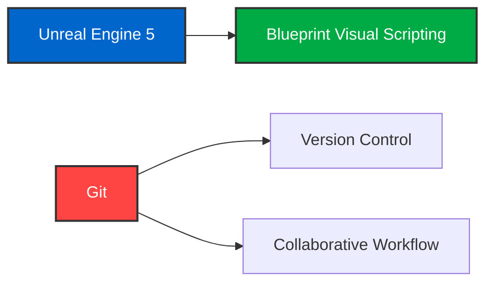

# [검은신화: 오공 호선봉 보스전 모작 프로젝트]

<div align="center">


**UE5 게임 개발 역량 향상을 위한 보스전 시스템 모작 프로젝트**

</div>

---

## ✓ Project Overview

```yaml
Project Name: 검은신화: 오공 호선봉 보스전 모작
Duration: 2025.07.07 - 2025.08.01 (25 days)
Team Size: 2 developers
Engine: Unreal Engine 5
Version Control: Git-based collaborative workflow
Goal: Boss battle system recreation & team collaboration skills
```

## ✓ Team & Role Distribution

<table align="center">
<tr>
<td align="center" width="50%">

<br><strong>조은정</strong><br>
<code>[오공]</code>
</td>
<td align="center" width="50%">

<br><strong>정하영</strong><br>
<code>[호선봉]</code>
</td>
</tr>
</table>

## ✓ Tech Stack & Tools

<div align="center">

### Core Technologies


</div>
